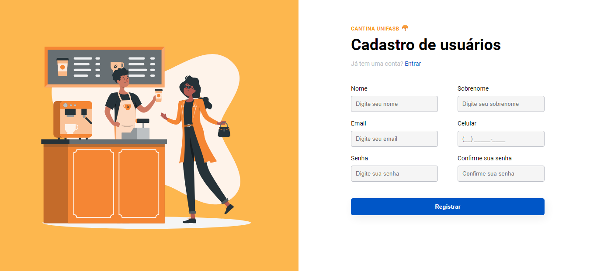

<h1 align="center">
  Cadastro - Cantina UNIFASB
</h1>

  

 

## 🛠️ Tecnologias

Esse projeto foi desenvolvido utilizando as tecnologias:

- HTML
- CSS
- JavaScript

## 🚀 Sobre o Projeto

Esse projeto foi construído com o objetivo de simular uma tela de cadastro para os funcionários da cantina da minha faculdade. O formulário está com todas as validações necessárias e a página está totalmente responsiva, adaptando-se aos diversos dispositivos móveis e desktop. 

Preview: https://edusmpaio.github.io/cantina-unifasb/

## 🎨 Atribuições 

Os ícones utilizados encontram-se no [IcoMoon](https://icomoon.io/).

A ilustração utilizada foi retirada do site [StorySet](https://storyset.com/).
